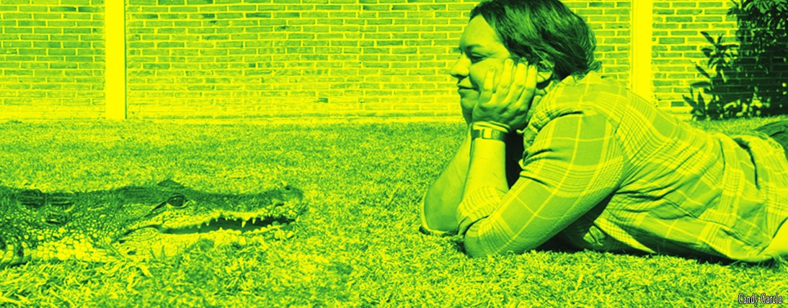

### Hi!👋  I´m Candy
##
 

 

- 🔭 
- ⚡ Fun fact:  I love reptiles
- 🤔 I'm actively seeking new and exciting opportunities. I have a strong passion for AI, blockchain, cryptocurrencies, trading, financial subjects, and initiatives related to social support or improvement.
 

 

I help startups and businesses scale through technology. 
I'm also willing to help NGOs on a  basis to achieve their goals through technology. 
I'm open to strategic collaborations based on equity or revenue sharing. 
If you have an ambitious project, let's talk about how I can add value.

  ### SOCIAL:
  

 
 	 
  
    

  ##
  

  

  ### TECHNOLOGIES:

  
   
  
  
  
  
  
  
   />
  
  

   
  <!-- https://dev.to/envoy_/150-badges-for-github-pnk -->

    
    
    
    
    
    
    
    
    
    
    
    
    
    

  
  ##
  

Play my mini game PikachIu :)
 

Demo Robot game in Unity :)

##
<table width="200%">
  <tr>
    <td align="center" width="50%">
      
    </td>
    <td align="center" width="50%">
      
    </td>
  </tr>
</table>
